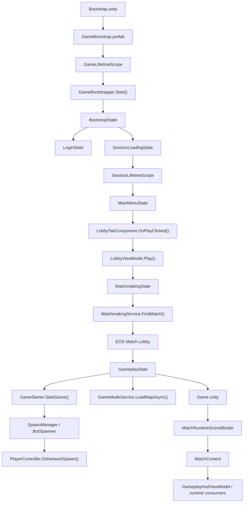
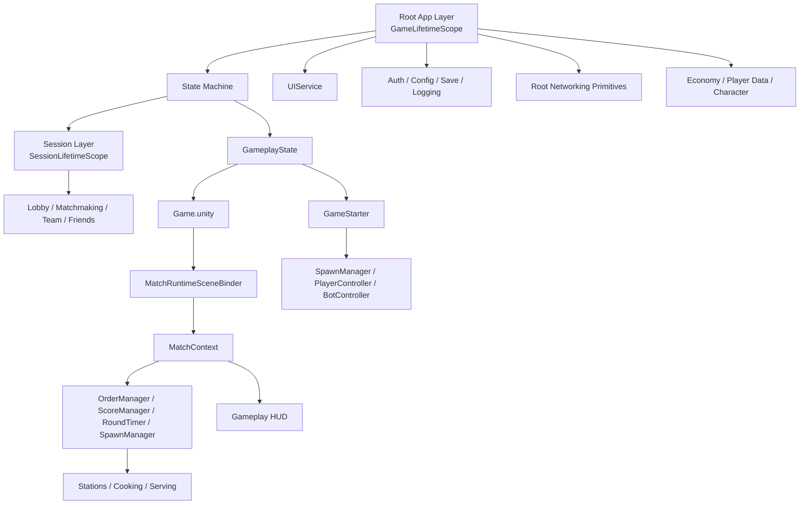

# RecipeRage Current Codebase Audit

This document is a current-code audit of the RecipeRage project as it exists in this repository on March 23, 2026.

It is written for two audiences at once:

- Developers: what owns what, which code actually runs, which services are root-scoped versus session-scoped, and where the main runtime transitions happen.
- Game designers: which systems shape the player experience, where menus hand off into matchmaking, what actually controls rounds, scoring, and kitchen play, and where the current implementation is incomplete or drifting.

This audit intentionally treats current code as truth. Historical docs are useful for context, but not for deciding what the project does today.

## Scope

This audit covers:

- startup scenes and runtime entry prefabs
- project-owned C# scripts under `Assets/Scripts`
- runtime architecture, state flow, gameplay flow, and major scene wiring
- likely stale, duplicated, or currently dormant logic

This audit does not try to document every art asset, plugin asset, `.meta` file, or third-party sample file.

## Snapshot

- Script count under `Assets/Scripts`: 284
- Build scenes currently enabled: `Bootstrap`, `MainMenu`, `Game`
- Runtime entry scene: `Assets/Scenes/Bootstrap.unity`
- Runtime bootstrap prefab: `Assets/Prefabs/General/GameBootstrap.prefab`
- Current documentation index: `Documentation/README.md`
- Current architecture source of truth: `Documentation/Architecture/PROJECT_MEMORY.md`
- Current current-state GDD: `KitchenClash_GDD_v3.md`
- Current scene/manual setup source of truth: `Documentation/Guides/gameplay-scene-setup.md`

## Source Of Truth Rules

Use these in this order:

1. Current code.
2. `Documentation/Architecture/PROJECT_MEMORY.md`.
3. `Documentation/Architecture/CURRENT_CODEBASE_AUDIT.md`.
4. `Documentation/Guides/gameplay-scene-setup.md` for scene wiring and inspector setup.
5. `KitchenClash_GDD_v3.md`.
6. Older docs only when they do not conflict with the code above.

Important drift note:

- stale flow docs and milestone docs have been moved under `Documentation/Archive/2026-03-cleanup/`.

## Runtime Flow

### Technical Flow

1. Unity starts `Assets/Scenes/Bootstrap.unity`.
2. `Bootstrap.unity` contains `Assets/Prefabs/General/GameBootstrap.prefab`.
3. That prefab provides `GameLifetimeScope`, `NetworkManager`, EOS manager, and the root `UIDocument`.
4. `GameLifetimeScope` registers root services and `GameBootstrapper`.
5. `GameBootstrapper.Start()` creates `BootstrapState` and initializes `GameStateManager`.
6. `BootstrapState` shows splash, initializes time sync, remote config, auth, maintenance checks, and then either:
   - goes to `LoginState`, or
   - continues to `SessionLoadingState`.
7. `SessionLoadingState` creates the child `SessionLifetimeScope`, syncs save data, initializes economy and player data, then moves to `MainMenuState`.
8. `MainMenuState` loads `MainMenu.unity`, shows `MainMenuView`, and may force a username popup for first-time users.
9. `LobbyTabComponent.OnPlayClicked()` calls `LobbyViewModel.Play()`.
10. `LobbyViewModel.Play()` calls `IGameStateManager.ChangeState<MatchmakingState>()`.
11. `MatchmakingState` starts `IMatchmakingService.FindMatch(...)`.
12. `MatchmakingService` either joins an EOS match lobby or creates one, then fills with bots after timeout if needed.
13. On `OnMatchFound`, `MatchmakingState` transitions to `GameplayState`.
14. `GameplayState` loads `Game.unity`, attempts additive map loading through `GameModeService`, initializes camera, then calls `_sessionContext.GameStarter.StartGame()`.
15. `GameStarter` starts Unity Netcode as host or client, manually spawns player objects through `SpawnManager`, and spawns bots if matchmaking created them.
16. `PlayerController.OnNetworkSpawn()` registers human players with `PlayerNetworkManager` only when `NetworkObject.IsPlayerObject` is true, then publishes local-player events.
17. `MatchRuntimeSceneBinder` pushes scene references into `MatchContext`, allowing HUD and app code to consume `OrderManager`, `ScoreManager`, `RoundTimer`, `SpawnManager`, and related runtime objects without repeated scene lookups.
18. Gameplay HUD reads live state from `MatchContext`, `OrderManager`, `RoundTimer`, `GamePhaseSync`, and `NetworkScoreManager`.

### Plain-English Flow

- The game starts in a tiny boot scene whose job is to build the app shell.
- The boot flow checks time, downloads live config, prepares login, and decides whether the player should see login or jump straight into a session.
- Once the session exists, the main menu is really a front end for session data: wallet, profile, selected mode, character, and social actions.
- Pressing Play does not start the match directly. It changes app state into matchmaking.
- Matchmaking looks for or creates an EOS match lobby, waits for players, and fills empty slots with bots after a short timeout.
- Once a lobby is ready, gameplay loads the game scene, starts network transport, spawns players and bots, then hands control to kitchen systems.
- During the match, orders, timers, scoring, stations, and mobile controls all hang off the live gameplay scene and are exposed back to UI through `MatchContext`.

## Layered Architecture

### Technical View

- Root app layer:
  - DI root, auth, remote config, persistence, event bus, logging, UI shell, root networking objects, root gameplay data services, app state machine.
- Session layer:
  - child DI scope for active-player networking services like matchmaking, lobby, team, and game start.
- Match runtime bridge:
  - `MatchContext` plus `MatchRuntimeSceneBinder`, which bridge scene `MonoBehaviour` objects back into root and session systems.
- Gameplay scene layer:
  - orders, score systems, timer, spawn points, stations, player/bot runtime.
- UI layer:
  - `UIService`, typed screens, view models, and category-based screen stacks.

### Plain-English View

- Root layer is the "game app shell".
- Session layer is the "logged-in player session".
- Match runtime bridge is the "adapter between app code and the loaded gameplay scene".
- Gameplay scene layer is the "actual kitchen match".
- UI layer is the "screen system that shows whatever the current app or gameplay state needs".

## Current Risks, Drift, And Likely Unwanted Logic

These are the most important cleanup targets found during the audit.

### 1. `MatchEndController` now owns round end, but runtime verification is still required

Relevant files:

- `Assets/Scripts/Gameplay/GameModes/MatchEndController.cs`
- `Assets/Scripts/Gameplay/App/State/States/GameOverState.cs`

Audit result:

- `MatchEndController` now starts the round, listens for timer expiry and team score changes, writes a synchronized `MatchResultSync` result snapshot, and sets `GamePhaseSync` to `GameOver`
- `GameplayHudViewModel` now waits for both the synchronized phase and synchronized final result before transitioning to `GameOverState`
- score-limit endings are implemented in code, but still need runtime verification in Unity

Why it matters:

- the project now has one gameplay-side owner for match completion instead of a HUD-driven timer shortcut
- the remaining risk is runtime validation, not missing architecture

### 2. Game mode assets point to additive map scenes that are not in build settings

Configured map scene names:

- `KitchenArena`
- `TeamArena`
- `FFAKitchen`

Current enabled build scenes:

- `Bootstrap`
- `MainMenu`
- `Game`

Why it matters:

- `GameplayState` asks `GameModeService` to load the selected map additively
- `GameModeService.LoadMapAsync()` now treats a missing scene as a warning and returns success
- that means gameplay can continue while the map-specific scene layer silently never loads

### 6. Zero-singleton architecture remains a planned target, not current reality

Representative files:

- `Assets/Scripts/Core/Auth/AuthenticationService.cs`
- `Assets/Scripts/Core/Networking/Services/LobbyService.cs`
- `Assets/Scripts/Core/Networking/Services/MatchmakingService.cs`
- `Assets/Scripts/Gameplay/App/Networking/GameStarter.cs`

Why it matters:

- the current repo still relies on static/global access patterns like `EOSManager.Instance`, `NetworkManager.Singleton`, and similar infrastructure hooks
- this is a known gap against the aspirational architecture and should be tracked as roadmap work rather than treated as accidental drift

## What The Game Currently Depends On Most

### Highest-importance runtime files

- `Assets/Scripts/Gameplay/Bootstrap/GameLifetimeScope.cs`
- `Assets/Scripts/Gameplay/Bootstrap/GameBootstrapper.cs`
- `Assets/Scripts/Gameplay/App/State/GameStateManager.cs`
- `Assets/Scripts/Gameplay/App/State/States/BootstrapState.cs`
- `Assets/Scripts/Gameplay/App/State/States/SessionLoadingState.cs`
- `Assets/Scripts/Gameplay/App/State/States/MainMenuState.cs`
- `Assets/Scripts/Gameplay/App/State/States/MatchmakingState.cs`
- `Assets/Scripts/Gameplay/App/State/States/GameplayState.cs`
- `Assets/Scripts/Core/UI/UIService.cs`
- `Assets/Scripts/Gameplay/Session/SessionManager.cs`
- `Assets/Scripts/Gameplay/App/Networking/NetworkingServiceContainer.cs`
- `Assets/Scripts/Gameplay/App/Networking/GameStarter.cs`
- `Assets/Scripts/Gameplay/Shared/MatchContext.cs`
- `Assets/Scripts/Gameplay/Shared/MatchRuntimeSceneBinder.cs`
- `Assets/Scripts/Gameplay/Spawning/SpawnManager.cs`
- `Assets/Scripts/Gameplay/Characters/PlayerController.cs`
- `Assets/Scripts/Gameplay/Cooking/OrderManager.cs`
- `Assets/Scripts/Gameplay/Stations/ServingStation.cs`
- `Assets/Scripts/Gameplay/Scoring/NetworkScoreManager.cs`
- `Assets/Scripts/Gameplay/UI/Features/Gameplay/GameplayHudViewModel.cs`

### Highest-importance gameplay assets

- `Assets/Scenes/Bootstrap.unity`
- `Assets/Scenes/MainMenu.unity`
- `Assets/Scenes/Game.unity`
- `Assets/Prefabs/General/GameBootstrap.prefab`
- `Assets/DefaultNetworkPrefabs.asset`
- `Assets/Resources/ScriptableObjects/GameModes/*.asset`
- `Assets/Resources/ScriptableObjects/Cooking/Ingredients/*.asset`

## File Responsibility Index

This index is grouped by folder. Every project-owned script under `Assets/Scripts` is accounted for below.

### Core / Animation

- `AnimationService.cs`: high-level animation facade used by app/UI code.
- `IAnimationService.cs`, `ITransformAnimator.cs`, `IUIAnimator.cs`: contracts for animation consumers and adapters.
- `DOTweenTransformAnimator.cs`, `DOTweenUIAnimator.cs`: DOTween-backed implementations for transform and UI animation.

### Core / Audio

- `AudioService.cs`: top-level audio orchestration service.
- `AudioPoolManager.cs`: pooled audio source management.
- `AudioSettings.cs`: shared audio tuning/config data.
- `AudioVolumeController.cs`: runtime volume and mute control.
- `IAudioService.cs`, `IAudioVolumeController.cs`, `IMusicPlayer.cs`, `ISFXPlayer.cs`: audio contracts.
- `MusicPlayer.cs`, `SFXPlayer.cs`: concrete music and effects playback.

### Core / Auth

- `AuthenticationService.cs`: unified EOS-first auth flow, with optional UGS sign-in for social features.
- `IAuthService.cs`: auth contract and `AuthType` enum.

### Core / Input

- `IInputProvider.cs`: input abstraction consumed by player code.
- `InputProviderFactory.cs`: creates the active input provider implementation.
- `PlayerInputActions.cs`: generated input system action map wrapper.
- `Providers/InputSystemProvider.cs`: concrete Unity Input System adapter.

### Core / Localization

- `ILocalizationManager.cs`, `LocalizationManager.cs`: runtime localization API and implementation.
- `Editor/LocalizationEditorWindow.cs`, `Editor/LocalizationGenerator.cs`: editor tools for generating and maintaining localization keys/data.

### Core / Logging

- `LoggingService.cs`: central logging service lifecycle owner.
- `ILoggingService.cs`: logging contract.
- `GameLogger.cs`: static convenience logger used across the project.
- `LogEntry.cs`, `LogLevel.cs`: logging data model and severity enum.

### Core / Networking / Common

- `LobbyConfig.cs`: lobby creation/update configuration object.
- `LobbyInfo.cs`: higher-level lobby read model used by app/gameplay code.
- `LobbyState.cs`, `LobbyType.cs`: lobby state and lobby kind enums.
- `NetworkTypes.cs`: shared network/player model types used by networking services.

### Core / Networking / Interfaces

- `IBotSpawner.cs`, `IBotSpawnerRegistry.cs`: bot-spawning contracts.
- `IFriendsService.cs`: friends-system contract.
- `IGameStarter.cs`: match-start/match-end contract for NGO transport startup.
- `ILobbyManager.cs`: lobby ownership and lifecycle contract.
- `IMatchmakingService.cs`: matchmaking lifecycle contract.
- `IPlayerController.cs`: common player-control interface for human and tracked players.
- `IPlayerManager.cs`: player-lobby data mutation contract.
- `ITeamManager.cs`: team-data contract.

### Core / Networking / Models

- `BotPlayer.cs`: lightweight bot descriptor used during matchmaking and spawning.

### Core / Networking / Services

- `ConnectivityService.cs`: network reachability and connectivity monitoring.
- `LobbyService.cs`: EOS-backed party lobby and match lobby manager.
- `MatchmakingService.cs`: find/join/create match lobbies, timeout, and bot fill.
- `PlayerManager.cs`: mutates current player's lobby member attributes such as ready/team/character.
- `TeamManager.cs`: caches and rebuilds lobby team membership data.
- `FriendsService.cs`: UGS Friends integration layer.
- `BotManager.cs`: creates lightweight bot descriptors during matchmaking.
- `PlayerNetworkManager.cs`: runtime registry of human player objects keyed by client ID.
- `INetworkGameManager.cs`, `INetworkObjectPool.cs`, `IPlayerNetworkManager.cs`: root gameplay-network contracts.
- `NetworkGameManager.cs`, `NetworkObjectPool.cs`: low-level network spawn/despawn and pooling implementations.

### Core / Networking / Config

- `UGSConfig.cs`: Unity Gaming Services configuration asset wrapper used by auth/friends.

### Core / Persistence

- `EncryptionService.cs`: save-encryption helper.
- `IEncryptionService.cs`, `ISaveService.cs`: persistence contracts.
- `SaveService.cs`: unified load/save/sync service.
- `GameSettingsData.cs`: saved user-settings data model.
- `Factory/StorageProviderFactory.cs`: chooses local/cloud storage providers.
- `Interfaces/IStorageProvider.cs`: storage provider contract.
- `Models/StorageConfig.cs`, `StorageStrategy.cs`, `SyncStatus.cs`: persistence strategy/config/sync metadata.
- `Providers/LocalStorageProvider.cs`, `EOSCloudStorageProvider.cs`: concrete local and EOS cloud save backends.

### Core / RemoteConfig

- `Services/RemoteConfigService.cs`: central live-config cache and refresh service.
- `Services/NTPTime.cs`, `Services/NTPTimeService.cs`: network time helpers and sync service.
- `Providers/FirebaseConfigProvider.cs`: Firebase-backed config source.
- `IMaintenanceService.cs`, `MaintenanceService.cs`: maintenance-window checks and maintenance events.
- `ForceUpdateChecker.cs`: force-update rule evaluation.
- `Interfaces/IConfigModel.cs`, `IConfigProvider.cs`, `INTPTimeService.cs`, `IRemoteConfigService.cs`: contracts for config and time services.
- `Enums/ConfigHealthStatus.cs`: service health enum.
- `Logic/MapRotationCalculator.cs`, `ShopRotationCalculator.cs`: rotation/timing helpers derived from live config.
- `Models/CharacterConfig.cs`, `ForceUpdateConfig.cs`, `GameSettingsConfig.cs`, `MaintenanceConfig.cs`, `MapConfig.cs`, `ShopConfig.cs`, `SkinsConfig.cs`: config payload models.

### Core / Shared

- `BindableProperty.cs`: lightweight reactive value used heavily by view models.
- `Enums/TeamCategory.cs`: shared team category enum for spawn/team ownership.
- `Events/EventBus.cs`, `GameEvents.cs`, `IEventBus.cs`: project event system.
- `Extensions/TweenExtensions.cs`: shared tween helpers.
- `Utilities/CoroutineRunner.cs`, `PlatformUtils.cs`, `TaskExtensions.cs`: generic helper utilities.

### Core / UI

- `UIService.cs`: typed UI router and screen lifecycle owner.
- `UIScreenController.cs`: per-screen view container/controller wrapper.
- `UIScreenStackManager.cs`: category-based history and stack tracking.
- `UIExtensions.cs`: shared UI convenience methods.
- `UIScreenCategory.cs`, `UIScreenPriority.cs`: screen categorization and priority enums.
- `Core/BaseUIScreen.cs`, `BaseViewModel.cs`: screen and view-model base types.
- `Core/UIScreenAttribute.cs`, `UIScreenRegistry.cs`: reflection-based screen registration metadata.
- `Core/UITransitionHandler.cs`, `UITransitionType.cs`: screen transition execution and transition enum.
- `Interfaces/IUIService.cs`, `IUIScreenStackManager.cs`, `INotificationScreen.cs`: UI contracts.
- `Controls/RadialGradientElement.cs`, `SkewedBoxElement.cs`: custom UI Toolkit visual elements.

### Editor Tools

- `CharacterSkinGenerator.cs`: editor utility for generating character-skin assets/workflow.
- `DevelopmentTools.cs`: general editor/dev helpers.
- `GameModeGenerator.cs`: game-mode asset generation helper.
- `IconDownloaderWindow.cs`: icon download/import helper.
- `InitialSetupGenerator.cs`: initial content/setup generation helper.

### Gameplay / App / Networking

- `GameStarter.cs`: starts and ends NGO gameplay sessions from lobby state, including manual player spawning and bot spawn hookup.
- `NetworkingServiceContainer.cs`: session-scoped bundle that constructs lobby, matchmaking, team, game-start, and friends services.

### Gameplay / App / State

- `IState.cs`, `BaseState.cs`: common app-state contract and base type.
- `StateMachine.cs`: low-level state machine executor.
- `IGameStateManager.cs`, `GameStateManager.cs`: app-level state owner used by the whole runtime.
- `IStateFactory.cs`, `GameStateFactory.cs`: VContainer-backed state creation.
- `States/BootstrapState.cs`: startup checks, splash, config, auth, maintenance.
- `States/LoginState.cs`: login-screen state and login-success subscription.
- `States/SessionLoadingState.cs`: child session creation plus economy/player-data init.
- `States/MainMenuState.cs`: main menu scene load and username gate.
- `States/MatchmakingState.cs`: matchmaking ownership, timeout, bot fill, return-to-menu paths.
- `States/GameplayState.cs`: gameplay scene load, camera init, map load request, and game start.
- `States/GameOverState.cs`: active game-over screen state reached from synchronized `GamePhaseSync` changes.

### Gameplay / Bootstrap

- `GameBootstrapper.cs`: first runtime entry point after DI root is built.
- `GameLifetimeScope.cs`: root DI registration for the entire app shell.
- `SessionLifetimeScope.cs`: child DI registration for active session services.

### Gameplay / Camera

- `CameraBoundsMarker.cs`: scene marker used for camera boundary discovery.
- `CameraController.cs`: runtime Cinemachine camera rig builder and shaker.
- `CameraSettings.cs`: camera tuning asset/model.
- `CameraShakeService.cs`: event-driven shake orchestration.
- `ICameraController.cs`: camera contract.

### Gameplay / Characters

- `CharacterClass.cs`, `CharacterStats.cs`, `CharacterUnlockData.cs`, `CharacterAbilityData.cs`, `AbilityType.cs`: character content and tuning data.
- `CharacterAbility.cs`: runtime ability base/logic hook.
- `CharacterService.cs`: loads characters, tracks unlocked and selected character.
- `ICharacterService.cs`: character-service contract.
- `IInteractable.cs`: interaction contract used by players and stations.
- `PlayerController.cs`: main player runtime object and orchestrator for movement, interaction, prediction, held items, team, and skins.
- `PlayerMovementController.cs`: rigidbody movement rules.
- `PlayerInputHandler.cs`: input smoothing and transformation.
- `PlayerNetworkController.cs`: client prediction and reconciliation helper.
- `PlayerInteractionController.cs`: nearby interact/use-ability helper.
- `PlayerStateController.cs`: movement-state machine.
- `PlayerMovementState.cs`, `PlayerInputData.cs`, `PlayerStateData.cs`: movement and prediction data models.
- `PlayerTeamVisuals.cs`: ally/enemy visual differentiation.
- `Visuals/CharacterPreviewManager.cs`: 3D lobby preview management for selected characters/skins.

### Gameplay / Cooking

- `Ingredient.cs`: ingredient content asset.
- `Recipe.cs`, `Order.cs`, `RecipeOrderState.cs`: recipe and order data definitions.
- `ItemBase.cs`: base class for holdable networked kitchen items.
- `IngredientItem.cs`: runtime ingredient state machine and visuals.
- `PlateItem.cs`: networked plate assembly state.
- `OrderManager.cs`: authoritative order generation and order lifecycle.
- `IDishValidator.cs`, `StandardDishValidator.cs`: plate validation and scoring-quality logic.
- `IngredientNetworkSpawner.cs`: server-only ingredient spawn/despawn wrapper using root network services.

### Gameplay / Economy

- `EconomyKeys.cs`: economy IDs and save keys.
- `Data/EconomyData.cs`: saved inventory/currency model.
- `EconomyService.cs`: balances, purchases, unlocks, and purchase notifications.

### Gameplay / Shared Constants

- `GameConstants.cs`: shared scene names and global constants.

### Gameplay / GameModes

- `GameMode.cs`, `GameModeCategory.cs`, `GamePhase.cs`: game-mode content model and mode/phase enums.
- `GameModeService.cs`: loads available game modes, applies queue gating, and handles additive map loading.
- `GamePhaseSync.cs`: network-synced current phase.

Cleanup note:

- the older dormant runtime game-mode logic path (`GameplayLifetimeScope`, `RoundStarter`, `GameModeController`, `IGameModeLogic`, and legacy logic classes) has been removed because it was not wired into any scene or prefab.

### Gameplay / Interaction

- `InteractableBase.cs`: reusable base class for interactable world objects.

### Gameplay / Match

- `IConfigService.cs`, `ConfigService.cs`: adapter over remote-config custom game rules.
- `IMatchService.cs`, `MatchService.cs`: queue catalog and queue-resolution service.
- `IOrderService.cs`, `OrderService.cs`: chooses which active order a served dish should satisfy.
- `MatchQueueDefinition.cs`: queue metadata model.

### Gameplay / Networking

- `INetworkingServices.cs`: session bundle contract for higher-level networking features.
- `LatencyMonitor.cs`: RTT/latency tracking around NGO transport.
- `NetworkingServiceUpdater.cs`: `MonoBehaviour` updater wrapper for networking services; currently appears unused in scene/prefab wiring.

### Gameplay / Networking / Bot

- `BotPlanningModels.cs`: all bot planning enums and data transfer models.
- `BotClaimRegistry.cs`: shared claim tracker so bots do not all chase the same order/counter.
- `BotKitchenSnapshot.cs`: scene snapshot builder for planner input.
- `BotTaskPlanner.cs`: decision engine that selects the next bot task.
- `BotController.cs`: server-authoritative bot runtime brain.
- `BotSpawner.cs`: network bot instantiation layer, optionally through `SpawnManager`.

### Gameplay / Persistence

- `PlayerDataService.cs`: player progression, profile stats, unlocks, and saved identity.
- `Data/PlayerProgressData.cs`, `PlayerStatsData.cs`: saved progression and stat models.

### Gameplay / Round And Scoring

- `RoundTimer.cs`: network-synced countdown timer with expiry events.
- `Scoring/NetworkScoreManager.cs`: player/team network score synchronization.
- `Scoring/ScoreManager.cs`: team score accumulation, combo logic, and order-completion scoring.

### Gameplay / Session

- `SessionManager.cs`: creates and destroys the child session scope and handles logout teardown.
- `ISessionContext.cs`, `SessionContext.cs`: typed gateway for session-scoped or session-relevant services.

### Gameplay / Shared

- `IMatchContext.cs`, `IMatchRuntimeRegistry.cs`, `MatchContext.cs`: app-visible match runtime gateway and registry.
- `MatchRuntimeSceneBinder.cs`: scene bridge that publishes live gameplay objects into `MatchContext`.
- `Events/GameplayEvents.cs`: gameplay-specific event payloads.
- `Stats/ModifiableStat.cs`, `StatModifier.cs`: stat-modifier utility types used by gameplay systems.

### Gameplay / Skins

- `ISkinsService.cs`, `SkinsService.cs`: skin loading, unlock, and equip service.
- `Data/SkinsData.cs`: skin data support model(s).

### Gameplay / Spawning

- `SpawnManager.cs`: server-side player and bot spawn orchestration using scene spawn points.
- `SpawnPoint.cs`: scene marker and config holder for spawn positions.

### Gameplay / Stations

- `StationBase.cs`: shared networked station interaction base.
- `StationNetworkController.cs`: station lock/state synchronization.
- `CounterStation.cs`: item handoff and plate assembly counter.
- `ProcessingStation.cs`: base class for timed ingredient-processing stations.
- `CuttingStation.cs`: cut-processing station.
- `CookingStation.cs`: cook-and-burn station with effects and camera shake.
- `IngredientCrate.cs`: ingredient source station.
- `PlateDispenser.cs`: shared/team-based plate source station.
- `ServingStation.cs`: order fulfillment station and score trigger.
- `SinkStation.cs`: dirty-plate sink and dish-wash gameplay.
- `TrashBin.cs`: disposal station for unwanted ingredients.

### Gameplay / UI / Components

- `Tabs/LobbyTabComponent.cs`: lobby tab controller that wires play, map, settings, skins, and squad-slot UI.
- `Tabs/ShopTabComponent.cs`: shop-tab UI behavior.
- `Tabs/SkinsTabComponent.cs`: skins-tab UI behavior.
- `Tabs/CharacterTabComponent.cs`: character-tab UI behavior.

### Gameplay / UI / Data And Extensions

- `Data/ShopData.cs`: shop content model for UI.
- `Extensions/LocalizationUIExtensions.cs`: UI-localization helper extensions.
- `Localization/LocalizationKeys.g.cs`: generated localization key constants.

### Gameplay / UI / Features / Auth

- `LoginView.cs`: login screen view.
- `LoginViewModel.cs`: guest login interaction and status text state.

### Gameplay / UI / Features / Character

- `CharacterDetailsView.cs`: character details screen.
- `CharacterSelectionView.cs`: character selection screen.
- `CharacterViewModel.cs`: character screen/session bridge.

### Gameplay / UI / Features / GameOver

- `GameOverScreen.cs`: game-over UI screen.

### Gameplay / UI / Features / Gameplay

- `GameplayHudView.cs`: gameplay HUD screen.
- `GameplayHudViewModel.cs`: HUD binding to live match context, orders, timer, phase, prompt, and mobile controls.

### Gameplay / UI / Features / Loading

- `LoadingView.cs`: loading overlay screen.
- `LoadingViewModel.cs`: progress/tips/version presentation for loading.

### Gameplay / UI / Features / Lobby

- `LobbyViewModel.cs`: game-mode display plus play-button handoff into matchmaking state.

### Gameplay / UI / Features / MainMenu

- `MainMenuView.cs`: root main menu screen and tab bootstrapper.
- `MainMenuViewModel.cs`: owns main menu child view models.

### Gameplay / UI / Features / Maps

- `MapSelectionView.cs`: game-mode or map selection UI.

### Gameplay / UI / Features / Matchmaking

- `MatchmakingView.cs`: matchmaking screen and visuals.
- `MatchmakingViewModel.cs`: player-count, timer, and cancel binding for matchmaking.

### Gameplay / UI / Features / Profile

- `ProfileView.cs`: player profile screen.

### Gameplay / UI / Features / Settings

- `SettingsView.cs`: settings screen.
- `SettingsViewModel.cs`: user settings, language, quality, logout, and clear-data actions.

### Gameplay / UI / Features / Shop

- `ShopViewModel.cs`: shop currency state and purchase path.

### Gameplay / UI / Features / Social

- `FriendsPopup.cs`: friends and party/social popup.

### Gameplay / UI / Features / System

- `SplashView.cs`: startup splash screen.
- `MaintenanceView.cs`: maintenance mode screen.
- `NoInternetPopup.cs`: network-loss popup.
- `NotificationView.cs`: toast/notification screen implementation.

### Gameplay / UI / Features / User

- `UsernamePopup.cs`: first-time or rename popup.
- `UsernameViewModel.cs`: username-popup logic.

### Gameplay / UI / Misc Runtime

- `DebugConsoleUI.cs`: in-game/debug console UI.
- `JoystickEditorUI.cs`: editor-like joystick tuning/debug UI.
- `MobileControlsManager.cs`: mobile action triggers used by HUD buttons.
- `MobileJoystick.cs`: mobile movement input widget.

### Gameplay / Empty Or Staging Folders

These folders exist but contain no project-owned scripts in the current repo snapshot:

- `Assets/Scripts/Gameplay/Auth`
- `Assets/Scripts/Gameplay/Maps`
- `Assets/Scripts/Gameplay/Networking/Services`
- `Assets/Scripts/Gameplay/UI/Screens`
- `Assets/Scripts/Domain`
- `Assets/Scripts/UI`

Treat them as staging or historical structure, not active architecture anchors.

### Tests

- `AuthenticationServiceTests.cs`: auth behavior coverage.
- `BotClaimRegistryTests.cs`: bot-claim arbitration coverage.
- `BotTaskPlannerTests.cs`: bot-planning decision coverage.
- `ConfigServiceTests.cs`: gameplay config adapter coverage.
- `MatchServiceTests.cs`: queue catalog and queue-resolution coverage.
- `OrderServiceTests.cs`: order-selection logic coverage.
- `PlayerProgressDataTests.cs`, `PlayerStatsDataTests.cs`: persistence model coverage.

## Practical Reading Order

If you want to understand the project quickly, read in this order:

1. `Documentation/Architecture/PROJECT_MEMORY.md`
2. `Assets/Scripts/Gameplay/Bootstrap/GameLifetimeScope.cs`
3. `Assets/Scripts/Gameplay/Bootstrap/GameBootstrapper.cs`
4. `Assets/Scripts/Gameplay/App/State/States/BootstrapState.cs`
5. `Assets/Scripts/Gameplay/App/State/States/SessionLoadingState.cs`
6. `Assets/Scripts/Gameplay/App/State/States/MainMenuState.cs`
7. `Assets/Scripts/Gameplay/UI/Components/Tabs/LobbyTabComponent.cs`
8. `Assets/Scripts/Gameplay/App/State/States/MatchmakingState.cs`
9. `Assets/Scripts/Gameplay/App/Networking/NetworkingServiceContainer.cs`
10. `Assets/Scripts/Gameplay/App/Networking/GameStarter.cs`
11. `Assets/Scripts/Gameplay/Shared/MatchContext.cs`
12. `Assets/Scripts/Gameplay/Shared/MatchRuntimeSceneBinder.cs`
13. `Assets/Scripts/Gameplay/Characters/PlayerController.cs`
14. `Assets/Scripts/Gameplay/Stations/ServingStation.cs`
15. `Assets/Scripts/Gameplay/UI/Features/Gameplay/GameplayHudViewModel.cs`

## Bottom Line

The project is currently strongest in:

- app bootstrap and state-driven flow
- menu-to-matchmaking handoff
- lobby and bot-fill matchmaking logic
- live gameplay object bridging through `MatchContext`
- station, order, and score building blocks

The project is currently weakest in:

- making round orchestration definitely active in the scene
- verifying timer-expiry and score-limit endings converge on `GameOverState` in live runtime
- removing root/session duplication for session-owned services
- aligning additive map loading with actual build scenes
- keeping documentation like `README.md` synchronized with the real architecture
