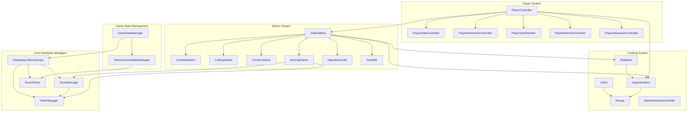
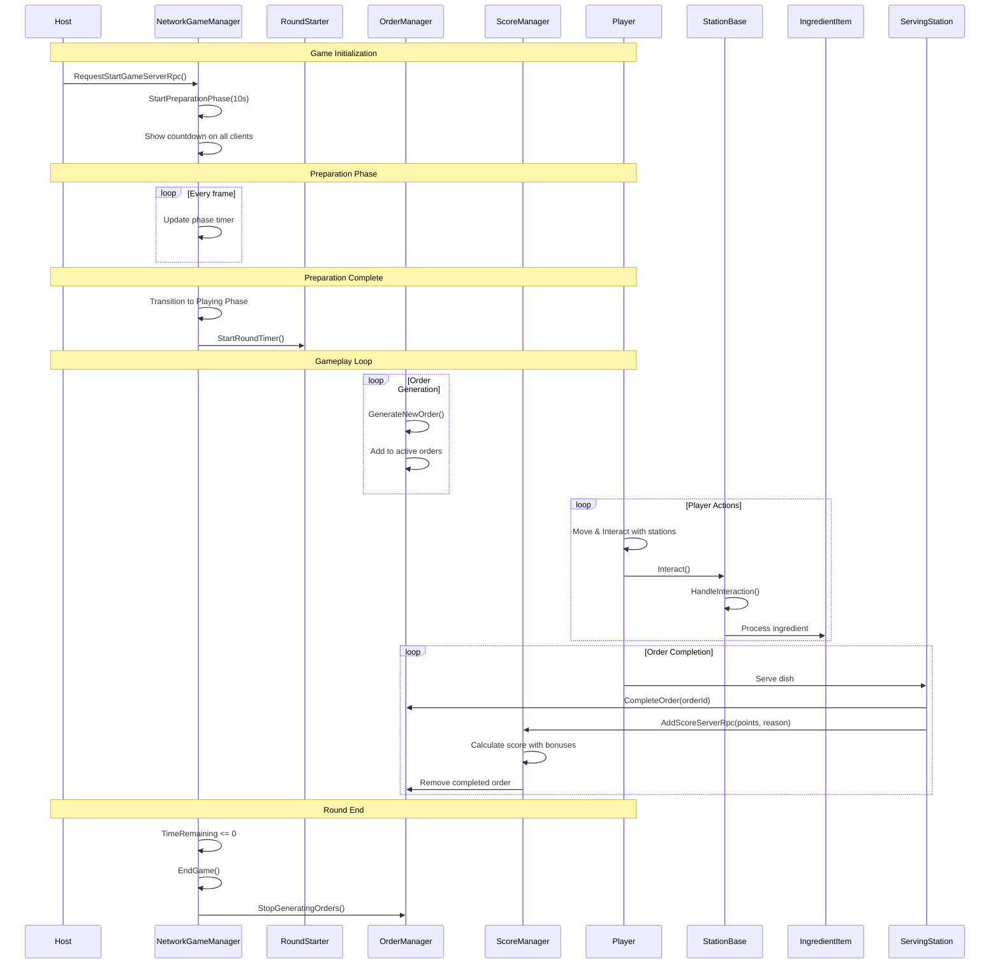
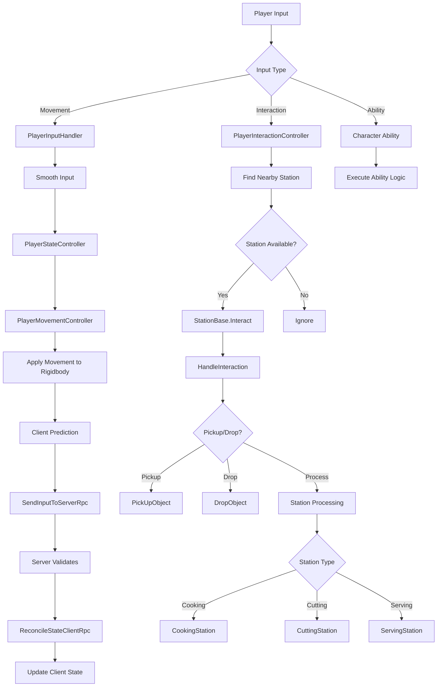
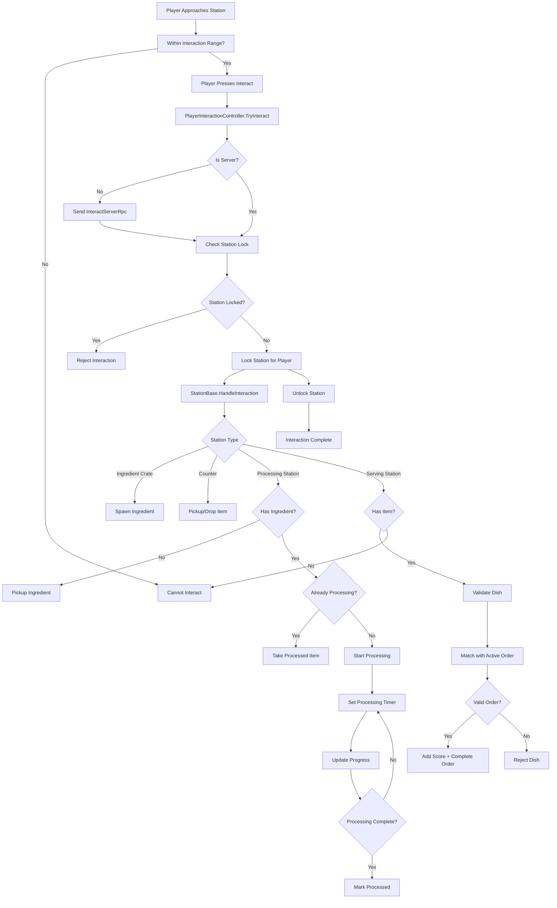
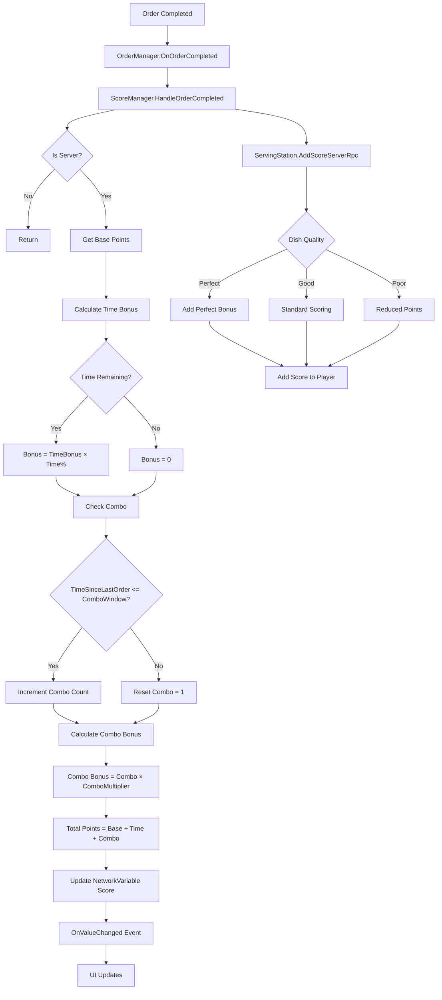
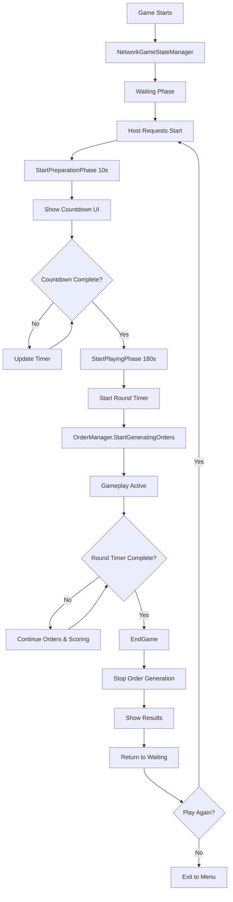

# RecipeRage Gameplay Code Flow

## Architecture Overview

This document illustrates the flow and architecture of the gameplay systems in RecipeRage.

## System Architecture

## Game Flow Sequence

## Player Controller Flow

## Station Interaction Flow

## Scoring System Flow

## Phase Management Flow

## Key Components Reference

### PlayerController (Assets/Scripts/Gameplay/Characters/PlayerController.cs:24)
- Orchestrates all player subsystems
- Manages movement, input, interaction, and network state
- Handles character abilities and object carrying

### NetworkGameStateManager (Assets/Scripts/Gameplay/App/State/NetworkGameStateManager.cs:15)
- Synchronizes game phases across network
- Controls preparation countdown and game duration
- Manages phase transitions (Waiting → Preparation → Playing → Results)

### OrderManager (Assets/Scripts/Gameplay/Cooking/OrderManager.cs:13)
- Generates recipe orders on server
- Tracks active orders and their time limits
- Handles order completion and expiration

### ScoreManager (Assets/Scripts/Gameplay/Scoring/ScoreManager.cs:12)
- Calculates scores for completed orders
- Manages combos and time bonuses
- Synchronizes score across network

### StationBase (Assets/Scripts/Gameplay/Stations/StationBase.cs:13)
- Base class for all gameplay stations
- Handles network locking for station access
- Defines interaction interface

### ServingStation (Assets/Scripts/Gameplay/Stations/ServingStation.cs:15)
- Validates completed dishes against orders
- Awards points for successful orders
- Integrates with ScoreManager for scoring

### CookingStation (Assets/Scripts/Gameplay/Stations/CookingStation.cs:10)
- Processes cooking operations on ingredients
- Handles burning mechanics
- Shows visual/audio feedback during cooking

## Data Flow Summary

1. **Initialization**: GameStateManager → NetworkGameStateManager → RoundStarter → OrderManager/ScoreManager
2. **Game Loop**: NetworkGameStateManager (phases) → OrderManager (orders) → Player actions → Station interactions → Score updates
3. **Network Sync**: Server RPCs for actions → Client RPCs for state updates → NetworkVariables for synchronized state
4. **Completion**: ServingStation → Order validation → Score calculation → Order removal

## Concurrency & Safety

- All state-changing operations happen on Server via ServerRpc
- NetworkVariables automatically synchronize state to clients
- Station locking prevents concurrent access conflicts
- Client prediction for movement with server reconciliation
