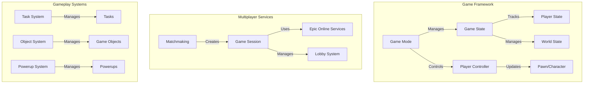

# RecipeRage Technical Specification

## Table of Contents
1. [System Architecture](#system-architecture)
2. [API Endpoints](#api-endpoints)
3. [Database Schemas](#database-schemas)
4. [Security Measures](#security-measures)
5. [Implementation Timeline](#implementation-timeline)
6. [Test Coverage](#test-coverage)

## System Architecture

### Core Components


### Component Interactions
- **Game Framework**: Core game logic and state management
- **Multiplayer Services**: Handles all network-related functionality
- **Gameplay Systems**: Manages game-specific mechanics

## API Endpoints

### Authentication
```typescript
POST /api/auth/login
POST /api/auth/register
POST /api/auth/refresh
DELETE /api/auth/logout
```

### Game Sessions
```typescript
POST /api/sessions/create
GET /api/sessions/{sessionId}
PUT /api/sessions/{sessionId}/join
DELETE /api/sessions/{sessionId}
```

### Player Management
```typescript
GET /api/players/{playerId}
PUT /api/players/{playerId}/update
GET /api/players/{playerId}/inventory
POST /api/players/{playerId}/purchase
```

### Leaderboards
```typescript
GET /api/leaderboards/global
GET /api/leaderboards/friends
POST /api/leaderboards/score
```

## Database Schemas

### Player Schema
```typescript
interface Player {
    id: string;
    username: string;
    email: string;
    stats: {
        wins: number;
        losses: number;
        bestScore: number;
        totalGames: number;
    };
    inventory: {
        skins: string[];
        powerups: PowerUp[];
        currency: {
            gems: number;
            coins: number;
        };
    };
    settings: {
        controls: ControlSettings;
        audio: AudioSettings;
        graphics: GraphicsSettings;
    };
}
```

### Game Session Schema
```typescript
interface GameSession {
    id: string;
    mode: GameMode;
    players: Player[];
    state: SessionState;
    startTime: Date;
    endTime?: Date;
    settings: GameSettings;
    scores: {
        [playerId: string]: number;
    };
}
```

### Transaction Schema
```typescript
interface Transaction {
    id: string;
    playerId: string;
    type: TransactionType;
    amount: number;
    currency: CurrencyType;
    timestamp: Date;
    status: TransactionStatus;
    items?: PurchasedItem[];
}
```

## Security Measures

### Authentication
- JWT-based authentication
- Refresh token rotation
- Rate limiting on auth endpoints
- Password hashing with bcrypt

### Data Protection
- End-to-end encryption for sensitive data
- HTTPS for all API communications
- Input validation and sanitization
- SQL injection prevention

### Anti-Cheat Measures
- Server-side validation
- Client-side integrity checks
- Replay protection
- Speed hack detection

## Implementation Timeline

### Phase 1: Core Framework (Weeks 1-3)
- Project setup and configuration
- Core game framework implementation
- Basic networking foundation

### Phase 2: Gameplay Systems (Weeks 4-7)
- Task system implementation
- Object system development
- Time system integration
- Power-up system creation

### Phase 3: Multiplayer Features (Weeks 8-11)
- Lobby system development
- Matchmaking implementation
- Character selection system

### Phase 4: UI and Shop (Weeks 12-14)
- UI framework setup
- Shop system implementation
- Inventory management

### Phase 5: Monetization (Weeks 15-16)
- Ad integration
- In-app purchase system
- Currency management

### Phase 6: Polish (Weeks 17-18)
- Performance optimization
- Bug fixes
- Final testing

## Test Coverage

### Unit Tests
- Minimum 80% code coverage
- All core systems tested
- Mock objects for external dependencies

### Integration Tests
- API endpoint testing
- Database integration testing
- Network communication testing

### End-to-End Tests
- Complete game flow testing
- Multiplayer session testing
- Purchase flow validation

### Performance Tests
- Load testing
- Stress testing
- Network latency testing 