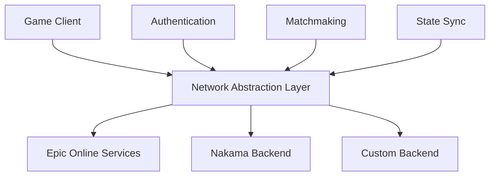
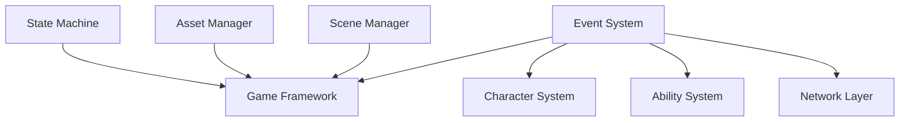

# Development Roadmap: Overcooked-Style Mobile Battle Royale

## Project Timeline Overview
Total Development Time: 12 months
- Pre-production: 1 month
- Core Development: 8 months
- Polish & Testing: 2 months
- Launch Preparation: 1 month

## Phase 1: Pre-production (Month 1)
### Week 1-2: Architecture Design
- [ ] Define module interfaces and communication patterns
- [ ] Design network abstraction layer for backend flexibility
- [ ] Plan data flow between core systems
- [ ] Design ScriptableObject-based configuration system
- [ ] Create module dependency diagram
- [ ] Set up version control and branching strategy

### Week 3-4: Development Environment Setup
- [ ] Configure Unity project with URP settings
- [ ] Integrate PlayEveryWare PUnity plugin
- [ ] Set up CI/CD pipelines
- [ ] Create development tools and editor extensions
- [ ] Establish coding standards and documentation templates
- [ ] Set up automated testing framework

## Phase 2: Core Framework Development (Month 2-3)
### Game Framework Module
- [ ] Scene management system
- [ ] Game state machine
- [ ] Event system architecture
- [ ] Object pooling system
- [ ] Asset loading system using Addressables
- [ ] Time management system
- [ ] Save/load system

### Gameplay Ability System
- [ ] Ability component system
- [ ] Effect system
- [ ] Targeting system
- [ ] Cooldown management
- [ ] Buff/debuff system
- [ ] Resource management (stamina, special powers)
- [ ] Ability replication system

### Character System
- [ ] Character base class
- [ ] Input handling system
- [ ] Movement controller
- [ ] Animation state machine
- [ ] Character ability container
- [ ] Character stats system
- [ ] Character customization system

## Phase 3: Networking Implementation (Month 4-5)
### Networking Core
- [ ] Epic Online Services integration
- [ ] Network abstraction layer
- [ ] Backend service interfaces
- [ ] State synchronization system
- [ ] Client prediction
- [ ] Server reconciliation
- [ ] Lag compensation

### Multiplayer Systems
- [ ] Matchmaking system
- [ ] Lobby management
- [ ] Room creation/joining
- [ ] Player session management
- [ ] Network time synchronization
- [ ] Disconnection handling
- [ ] Cross-platform compatibility

## Phase 4: Gameplay Systems (Month 6-7)
### Kitchen Mechanics
- [ ] Ingredient system
- [ ] Cooking mechanics
- [ ] Recipe system
- [ ] Kitchen appliance interaction
- [ ] Order management
- [ ] Scoring system
- [ ] Time management

### Battle Royale Elements
- [ ] Arena shrinking system
- [ ] Power-up system
- [ ] Elimination mechanics
- [ ] Safe zone management
- [ ] Team system
- [ ] Ranking system
- [ ] Match progression system

### AI Systems
- [ ] Pathfinding implementation
- [ ] Bot behavior system
- [ ] Dynamic difficulty adjustment
- [ ] Kitchen hazard AI
- [ ] NPC interaction system
- [ ] AI director for event management

## Phase 5: Content Development (Month 8-9)
### Map System
- [ ] Map loading system
- [ ] Dynamic obstacle system
- [ ] Hazard system
- [ ] Interactive elements
- [ ] Environment effects
- [ ] Map streaming optimization
- [ ] Map voting system

### Character Content
- [ ] Character ability designs
- [ ] Character progression system
- [ ] Cosmetic system
- [ ] Character balancing tools
- [ ] Character selection UI
- [ ] Tutorial system
- [ ] Practice mode

## Phase 6: UI/UX Implementation (Month 10)
### Interface Systems
- [ ] HUD system
- [ ] Menu framework
- [ ] Gameplay UI elements
- [ ] Social features UI
- [ ] Store interface
- [ ] Settings menu
- [ ] Achievement display

### Audio System
- [ ] Sound manager
- [ ] Music system
- [ ] Spatial audio
- [ ] Voice chat integration
- [ ] Sound pooling
- [ ] Audio mixing
- [ ] Dynamic audio system

## Phase 7: Polish and Optimization (Month 11)
### Performance
- [ ] Memory optimization
- [ ] CPU optimization
- [ ] GPU optimization
- [ ] Network optimization
- [ ] Loading time optimization
- [ ] Battery usage optimization
- [ ] Device-specific optimizations

### Quality Assurance
- [ ] Automated testing setup
- [ ] Performance profiling
- [ ] Network stress testing
- [ ] Cross-platform testing
- [ ] Security testing
- [ ] Anti-cheat implementation
- [ ] Analytics implementation

## Phase 8: Launch Preparation (Month 12)
### Backend Infrastructure
- [ ] Server deployment strategy
- [ ] Database setup
- [ ] Analytics pipeline
- [ ] Monitoring systems
- [ ] Backup systems
- [ ] Scaling strategy
- [ ] Emergency response plan

### Store Deployment
- [ ] App store optimization
- [ ] Marketing materials
- [ ] Store listing setup
- [ ] In-app purchase testing
- [ ] Soft launch preparation
- [ ] Regional deployment strategy
- [ ] Update pipeline setup

## Post-Launch Support
### Live Operations
- [ ] Content update pipeline
- [ ] Season pass system
- [ ] Event system
- [ ] Daily/weekly challenges
- [ ] Reward system
- [ ] Tournament system
- [ ] Community features

### Maintenance
- [ ] Bug tracking system
- [ ] Performance monitoring
- [ ] Player feedback system
- [ ] Balance adjustment tools
- [ ] Content deployment system
- [ ] Version control strategy
- [ ] Documentation maintenance

## Technical Integration Points
### Backend Flexibility

### Module Communication

## Risk Mitigation
- Implement feature flags for gradual rollout
- Create fallback systems for network failures
- Design scalable systems for future content
- Plan for backwards compatibility
- Establish monitoring and alerting systems
- Create disaster recovery procedures
- Document all critical systems

## Coding Standards
- Follow SOLID principles
- Implement dependency injection
- Use interface-based programming
- Create comprehensive unit tests
- Document all public APIs
- Establish code review process
- Maintain consistent naming conventions

## Tools and Frameworks
- Unity 2022 LTS
- PlayEveryWare PUnity Plugin
- Universal Render Pipeline
- DOTween for animations
- Unity Addressables
- Unity Test Framework
- Unity Profiler
