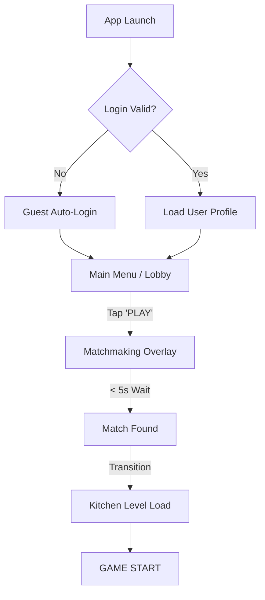
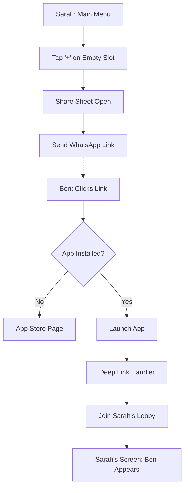
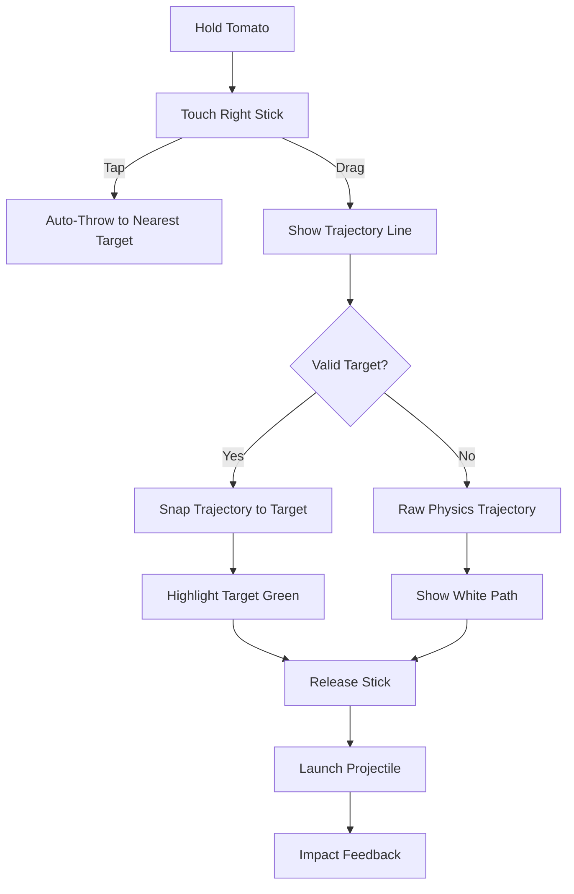

# UX Design Specification - RecipeRage

**Author:** Arshad
**Date:** 2026-02-04

---

<!-- UX design content will be appended sequentially through collaborative workflow steps -->

## Executive Summary

### Project Vision
RecipeRage is a mobile-first, online multiplayer cooking competition game that restores the "couch chaos" of party games for friends separated by distance. It solves the critical lag issues of competitors with esports-grade P2P networking and ensures matches are always available via smart bot filling. The core experience combines the cooperative tension of Overcooked with the strategic depth and progression of mobile action games like Brawl Stars.

### Target Users
*   **Social Scheduler Sarah (24-34):** The connector who wants to reclaim lost game nights with distant friends. Needs low-friction invites and lag-free play.
*   **Competitive Casual Chris (18-28):** The mobile gamer seeking skill-based competition without toxicity. Driven by mastery of the character ability system.
*   **Downtime Diana (28-42):** The busy professional needing 15-minute escapes. Values instant matchmaking and visible personal progression.

### Key Design Challenges
1.  **Mobile Control Density:** Balancing standard cooking inputs (move, chop, throw) with active character ability buttons on limited touchscreens.
2.  **Bot Transparency:** Designing the "human + bot" match experience to feel competitive and rewarding, avoiding the "hollow victory" feeling.
3.  **Onboarding Velocity:** Getting players from "install" to "first meaningful win" in under 2 minutes to prove the "no lag" promise.

### Design Opportunities
*   **"Brawl-Style" Instant Access:** Mirroring Brawl Stars' "one giant button" lobby design to minimize time-to-fun for users like Diana.
*   **Visual Ability Language:** Using clear, MOBA-style visual telegraphs (cones, radiuses) for abilities to make strategy readable without text.
*   **Social Glue Loop:** Implementing a friction-free "Play Again" system that encourages strangers to form temporary teams, building community organically.

## Core User Experience

### Defining Experience
The core experience of RecipeRage is **"High-Velocity Cooperative Chaos."** Users engage in short, intense 3-5 minute cooking battles where communication and reflex execution are key. The primary loop involves navigating a kitchen, processing ingredients, and delivering orders under time pressure, layered with strategic character ability usage.

### Platform Strategy
*   **Mobile-First (iOS/Android):** Optimized for landscape touch interaction.
*   **Control Scheme:** Dual Virtual Stick (Left: Movement, Right: Context Action/Ability Aim).
*   **Session Context:** Designed for fragmented play (waiting rooms, commutes) with 5-10 minute total commitment, but sticky enough for hour-long social sessions.
*   **Always-Online:** Requires stable connection, but tolerant of minor packet loss via client-side prediction.

### Effortless Interactions
*   **Context-Sensitive Action Button:** A single large button that changes function based on context (Chop near board, Throw when holding item, Serve near window). Reduces button clutter.
*   **Smart Throw Assist:** subtle aim-assist when throwing ingredients to pots or teammates to minimize frustration on touchscreens.
*   **Instant Matchmaking:** "Play" button immediately transitions to game start sequence, filling empty slots with bots seamlessly.

### Critical Success Moments
1.  **The First Lag-Free Throw:** When a player throws an item to a friend and they catch it seamlessly, proving the networking technology.
2.  **The Ability Clutch:** Successfully using a character ability (e.g., Push) to disrupt an opponent or save a dish, validating the "competitive depth" promise.
3.  **The Frictionless Invite:** A user clicking a shared link and landing directly in their friend's lobby without account creation barriers.

### Experience Principles
1.  **Fluidity Over Precision:** Controls should assist the player's intent rather than demanding pixel-perfect input.
2.  **Velocity is Vital:** Minimize time from app-open to gameplay. Eliminate "waiting room hell."
3.  **Readable Chaos:** Visual hierarchy must prioritize game state (orders, hazards) over decorative elements.
4.  **Bot Transparency:** Bots fill gaps to ensure velocity but should behave naturally enough to not break immersion.

## Desired Emotional Response

### Primary Emotional Goals
*   **"Controlled Panic" (In-Game):** The exhilarating tension of managing chaos. Players should feel stressed but empowered, entering a flow state where reflex and strategy merge.
*   **"High-Five Energy" (Win):** The shared triumph of perfect coordination. A sense of "we did that together" that bonds strangers.
*   **"Constructive Chaos" (Loss):** Defeat should feel like a slapstick comedy routine, not a system failure. "We messed up, but it was funny."

### Emotional Journey Mapping
1.  **Entry (Discovery):** Instant readiness. "The kitchen is open." Anticipation of action.
2.  **The Grind (Mid-Match):** Rythmic satisfaction. The audio-visual loop of chop-sizzle-ding creates a satisfying work cadence.
3.  **The Crunch (Last 60s):** Adrenaline spike. Music accelerates, UI pulses. The feeling of a race to the finish line.
4.  **The Release (Results):** Validation. Even in defeat, the game highlights individual contributions ("Most Chopped", "Best Save"), preserving ego and encouraging a replay.

### Micro-Emotions
*   **Delightful Failure:** Mistakes (burning food, falling off map) have comedic animations/sounds to diffuse toxicity.
*   **Heroism:** Ability activation provides immediate audio-visual feedback that makes the player feel powerful and impactful.
*   **Synchronicity:** Subtle visual cues when players work in tandem (e.g., dual-chopping rhythm) reinforce the feeling of connection.

### Design Implications
*   **Audio-Visual Feedback:** Use "juicy" feedback (screen shake, particle explosions, bass-heavy sounds) for successful actions to reinforce the "Heroism" feeling.
*   **Celebratory End Screens:** Highlight diverse achievements (not just score) to validate every player style (Support, Speed, PvP).
*   **Comedic Physics:** Use exaggerated ragdoll or bounce physics for collisions to ensure "Delightful Failure" rather than frustration.

### Emotional Design Principles
1.  **Stress must be fun:** Tension is good; frustration is bad. The game fights the players, but the controls never should.
2.  **Everyone is an MVP:** Every player contributes something. Find it and celebrate it at the end of the match.
3.  **Laugh at the Chaos:** When the kitchen burns down, make it a spectacle, not a tragedy.

## UX Pattern Analysis & Inspiration

### Inspiring Products Analysis
*   **Brawl Stars (Mobile Action):** The gold standard for "time-to-fun." The main menu *is* the lobby, reducing clicks to zero. We will adopt this "Lobby-First" architecture.
*   **Overcooked (Console Co-op):** The masterclass in "forced cooperation." We will adapt their visual language for hazards (flashing icons, screen shake) but simplify the complexity for mobile screens.
*   **Among Us (Social Party):** Proved that the "waiting room" should be a playground. We will implement a "Playable Lobby" where users can practice chopping while waiting for friends.

### Transferable UX Patterns
*   **Dual-Stick MOBA Controls:** Left stick moves, right stick aims throws/abilities. Tap right stick to auto-target nearest pot/player.
*   **Contextual "Smart Button":** A single, large action button that morphs based on context (Chop, Wash, Throw, Serve) to minimize UI clutter.
*   **Peripheral Status Indicators:** Critical alerts (burning food, low time) use screen-edge pulses or color changes, readable without looking directly at the UI element.

### Anti-Patterns to Avoid
*   **"Ready Check" Fatigue:** Requiring all players to tap "Ready" between every match kills momentum. The leader controls the queue; players can opt-out if needed.
*   **Hidden Recipes:** Never force a player to open a menu to remember a recipe. Recipes must be permanently docked on the HUD.
*   **Static List Lobbies:** A list of usernames is boring. Show the 3D characters in a kitchen scene to build immersion immediately.

### Design Inspiration Strategy
1.  **Adopt Brawl Stars' Architecture:** Flatten the navigation hierarchy. The game launches directly into the "Ready to Play" state.
2.  **Adapt Overcooked's Visuals:** Use high-contrast, clearly silhouetted ingredients that are readable even on a 5-inch phone screen.
3.  **Innovate on Social:** Turn the "Invite" process into a "Join my Kitchen" link that bypasses all menus and drops the friend directly into the playable lobby.

## Design System Foundation

### 1.1 Design System Choice
**Hybrid Unity Architecture:**
*   **Menus/Navigation:** Unity UI Toolkit (USS/UXML) for scalable, responsive layouts (Flexbox architecture).
*   **In-Game HUD:** Unity uGUI (Canvas) for high-performance world-space interaction (floating health bars, damage numbers).

**Visual Style: "Soft-Boiled Vector"**
A custom aesthetic optimized for readability on small screens while evoking "toy-like" friendliness.

### Rationale for Selection
*   **Responsiveness:** UI Toolkit's flex layout handles the fragmentation of mobile aspect ratios (iPad vs. tall Androids) significantly better than uGUI anchors.
*   **Performance:** Keeping complex menu logic in UI Toolkit separates it from the game loop, preserving frame budget for physics/gameplay.
*   **Aesthetic Alignment:** The "Soft-Boiled" style matches the "Controlled Panic" emotion—it's chaotic but soft/safe, reducing visual stress during intense gameplay.

### Implementation Approach
*   **Global Stylesheet (USS):** Define color palette (Tomato Red, Lettuce Green), typography (Rounded Sans), and common component shapes once.
*   **Component Library:** Build reusable "Smart Components" in UXML (e.g., `<PrimaryButton>`, `<FriendCard>`, `<RecipeIcon>`).
*   **Atlas Management:** All UI icons packed into tight atlases to minimize draw calls on mobile.

### Customization Strategy
*   **Theme Classes:** Use USS classes (`.theme-fire`, `.theme-ice`) to instantly recolor the UI for different levels or events without changing logic.
*   **Animation Layer:** Implement a standard "Juice Controller" script that adds squash-and-stretch tweens to any interactive UI element automatically.

## 2. Core User Experience (Refined)

### 2.1 Defining Experience: "The Contextual Throw"
The defining interaction of RecipeRage is the **"Smart Throw."** Unlike console games requiring precise analog stick aiming, RecipeRage implements a "Magnetic Aim Assist" system. When a player drags to throw, the trajectory snaps to relevant targets (pots, teammates, serving windows), making complex kitchen maneuvers feel effortless and ninja-like on a touchscreen.

### 2.2 User Mental Model
*   **Expectation:** Users expect the game to interpret their *intent*, not just their raw input. "I aimed at the pot, why did it hit the wall?" is a failure of the system, not the user.
*   **Context Awareness:** Users expect the "Action Button" to be smart. If I'm holding nothing, it should "Pick Up." If I'm holding a tomato, it should "Throw" or "Chop" depending on what I'm facing.

### 2.3 Success Criteria
*   **Intention > Precision:** The system prioritizes the object the player *likely* wanted to hit over exact pixel perfection.
*   **Zero-Frustration Selection:** In crowded spaces (two pots next to each other), the target highlight must be distinct and switch cleanly so the player knows exactly where the item will go.
*   **The "Thwack" Factor:** Every successful catch or pot-landing provides juicy audio-visual feedback (screen shake, sound effect) to reward the action.

### 2.4 Novel UX Patterns
*   **Hybrid Stick-Button:** The right control is both a button (Tap to auto-throw to nearest target) and a stick (Drag to aim manually). This bridges the gap between casual players (tapping) and competitive players (aiming).
*   **Target Preview:** A "Ghost Icon" appears over the target (e.g., a translucent tomato over the pot) *while* aiming, confirming the destination before release.

### 2.5 Experience Mechanics (The Throw Loop)
1.  **Initiation:** Player picks up item. Right button morphs to "Throw Icon."
2.  **Aiming:**
    *   **Tap:** Auto-throw to best target (smart context).
    *   **Drag:** Manual aim with magnetic snap-to-target.
3.  **Telegraphing:** Trajectory line changes color (White = Wall/Floor, Green = Valid Target). Target object pulses.
4.  **Execution:** On release, item travels in a physics arc.
5.  **Result:** "Catch" animation played on target (Pot lid opens, Friend's hands grab).

## Visual Design Foundation

### Color System: "The Salad Bowl"
A high-saturation palette inspired by fresh ingredients.
*   **Tomato Red (`#FF5252`):** Primary Action (Throw/Cook), Urgent Alerts.
*   **Lettuce Green (`#66BB6A`):** Success states, "Ready" buttons, Teammate health.
*   **Mustard Yellow (`#FFD54F`):** Rewards, XP, MVP highlights.
*   **Creamy Tile (`#FFF8E1`):** App backgrounds (warm, non-clinical).
*   **Charcoal (`#37474F`):** Text and UI outlines (softer than #000000).

### Typography System
*   **Headings:** **Fredoka One** (or similar rounded display font). Bubbly, friendly, high x-height.
*   **Body:** **Nunito** (Rounded Sans). Excellent legibility at small sizes.
*   **Scale:**
    *   **Hero:** 48px (Victory/Defeat)
    *   **Header:** 32px (Lobby Titles)
    *   **Button:** 20px (All Caps, Bold)
    *   **Body:** 16px (Chat/Info)

### Spacing & Layout Foundation
*   **Grid:** 8px baseline grid.
*   **Touch Targets:** Minimum 48x48px interactive area.
*   **Thumb Zones:** Critical actions (Jump/Throw) placed in bottom corners; Information (Score/Time) placed in top center (hard to reach but easy to see).
*   **Corner Radius:** 16px standard for panels; 24px/Circle for buttons.

### Accessibility Considerations
*   **Double Coding:** Status changes use Color + Shape + Animation (e.g., Timer turns red AND pulses AND shakes).
*   **High Contrast:** White text on colored buttons always uses a drop shadow or outline to ensure contrast against 3D backgrounds.
*   **Motion Sensitivity:** Option to disable "Screen Shake" for users prone to motion sickness.

## Design Direction Decision

### Design Directions Explored
We explored three primary layout directions:
1.  **The Stage:** Hero-centric, orbital navigation (Brawl Stars style).
2.  **The Kitchen:** Immersive, diegetic navigation (Among Us style).
3.  **The Dashboard:** Efficient, tab-based navigation (Esports app style).

We also evaluated a visual style reference ("Neon Kitchen") featuring dark modes, high-contrast gold/red accents, and skewed "tech" containers.

### Chosen Direction: "Neon Kitchen Stage"
**Hybrid Approach:** Combining the **"Stage" layout** (Direction A) with the **"Neon Kitchen" visual style**.

**Why:**
*   **Layout:** "The Stage" focuses on the 3D character, which supports monetization (skins) and personal connection.
*   **Visuals:** The "Neon Kitchen" aesthetic (Dark mode, Gold, Red, Glassmorphism) communicates "Competitive Esports" far better than the previous "Soft-Boiled" cartoon style. It differentiates RecipeRage from the cute/casual cooking game crowd.

### Design Rationale
*   **Asset Alignment:** Matches existing `Anton` and `Rajdhani` fonts and `DesignSystem.uss` variables found in the codebase.
*   **Target Audience:** Appeals to competitive mobile gamers (Brawl Stars, Apex Mobile) rather than casual puzzle players.
*   **Readability:** High-contrast Neon on Black is superior for quick reading in fast-paced gameplay.

### Implementation Approach
*   **Global Styles:** Utilize existing `--theme-yellow` and `--bg-dark` variables in `DesignSystem.uss`.
*   **UI Toolkit:** Use `.panel-glass` and `.skew-container` classes to replicate the CSS transforms from the reference.
*   **Motion:** Implement the "Radar Pulse" and "Glitch" effects using Unity Shader Graph on UI elements.

## User Journey Flows

### Journey 1: The "Instant Play" Loop
**User:** Diana (Busy Professional)
**Goal:** Play a match in <10 seconds.

### Journey 2: The "Squad Up" Social Loop
**User:** Sarah (Social Connector)
**Goal:** Invite friend Ben to lobby.

### Journey 3: The "Contextual Throw" Micro-Flow
**User:** Chris (Competitive Player)
**Goal:** Throw tomato into pot accurately.

### Flow Optimization Principles
1.  **Lobby-First Architecture:** The main menu *is* the lobby. There is no "Create Party" button; you are always in a party of 1 by default.
2.  **Deep Link Priority:** Incoming deep links (invites) override all other states (splash screens, previous menus) to drop the user directly into the social context.
3.  **Smart Defaults:** Matchmaking defaults to "Quick Play" (Standard Mode) to reduce decision fatigue for casual sessions.

## Component Strategy

### Design System Foundation
We leverage the existing `DesignSystem.uss` for atomic tokens (Colors, Fonts, Spacing). We extend this with a **"Neon Glass"** utility layer for our specific aesthetic needs.

### Custom Component Specifications

#### 1. `<EsportsPlayerCard>`
*   **Purpose:** The primary unit of the lobby and loading screen. Represents a player slot.
*   **Anatomy:** Skewed container (-10deg), Avatar (left), Info Block (right, counter-skewed +10deg).
*   **Classes:** `.card-glass`, `.skew-container`, `.border-neon`.
*   **States:**
    *   `Searching`: Pulsing opacity, "Searching..." text.
    *   `Occupied`: Shows player data, solid background opacity (85%).
    *   `Ready`: Border turns `--theme-yellow`, glow effect enabled.

#### 2. `<SmartActionButton>`
*   **Purpose:** Context-sensitive gameplay trigger. Replaces multiple buttons with one.
*   **Anatomy:** Large circular button (120px+), Dynamic Icon center, Cooldown overlay ring.
*   **Interaction:**
    *   **Tap:** Trigger context action (Chop/Throw).
    *   **Drag:** Enter aiming mode (Throw trajectory).
*   **Feedback:** Haptic thud on state change.

#### 3. `<LobbyRadar>`
*   **Purpose:** Visualization of the matchmaking process.
*   **Anatomy:** Central user avatar, 3 concentric rings (SVG/Vector), Rotating radar sweep.
*   **Behavior:** Rotation speed increases as "Estimated Time" decreases. Turns green on "Match Found."

### Component Implementation Strategy
1.  **Atomic Class CSS:** Define `.glass-panel`, `.text-glitch`, `.skew-10` in `DesignSystem.uss` first.
2.  **UXML Templates:** Create separate `.uxml` files for `EsportsPlayerCard.uxml` to allow re-use in Lobby and Game Over screens.
3.  **Controller Scripts:** Each component gets a `VisualElement` controller script (e.g., `PlayerCardUI.cs`) to handle state changes logic.

### Implementation Roadmap
*   **P0 (Critical):** `EsportsPlayerCard`, `SmartActionButton`.
*   **P1 (Visuals):** `LobbyRadar`, `GlitchLabel` (Text with shader support).
*   **P2 (Polish):** `ParticleContainer` (UI-space particle effects for level ups).

## UX Consistency Patterns

### Button Hierarchy
*   **Primary (Gold/Neon):** Used for positive progression (Play, Accept, Buy). Always positioned bottom-right on mobile.
*   **Secondary (Glass/White):** Used for navigation or neutral actions (Settings, Profile).
*   **Destructive (Red/Glitch):** Used for irreversible actions. Requires "Hold to Confirm" interaction pattern for deleting items or leaving ranked matches.

### Feedback Patterns
*   **The "Glitch" Error:** We don't use standard popups for errors. We use a "Glitch" shader effect on the UI element itself (e.g., if you can't afford an item, the price text glitches red).
*   **Haptic Language:**
    *   **Heavy Thud:** Throw, Hit, Primary Button.
    *   **Light Tick:** Scrolling lists, toggling options.
    *   **Buzz:** Error, Damage Taken.

### Navigation Patterns
*   **Orbital Camera:** Navigation isn't just screen transitions; it's camera movement around the 3D character. Tapping "Skins" pans the camera to the character's outfit.
*   **Persistent Footer:** The "Play" button is permanently docked in the bottom-right corner, regardless of which sub-menu (Shop/Profile) is open.

### Modal Patterns
*   **Glassmorphism:** All overlays use a `Blur(15px)` shader on the background world instead of a solid dimming layer.
*   **One-Handed Close:** All modals must have a "Close" button within reach of the right thumb, or support "Swipe Down" to dismiss.

## Responsive Design & Accessibility

### Responsive Strategy
*   **Aspect Ratio Adaptability:** Support ranges from **4:3** (iPad) to **21:9** (Ultra-wide phones).
*   **Safe Area Management:** All critical UI anchors respecting device notches/home bars (`SafeArea` container).
*   **Camera FOV:** Horizontal+ scaling to ensure wider screens see more kitchen (peripheral advantage) without vertically cropping content.

### Accessibility Strategy
*   **Color Independence:** Gameplay cues use **Shape + Animation** alongside color (e.g., Cooking Timer is a circular fill + flashing icon + color change).
*   **Visual Clarity:** "High Contrast Mode" option that adds thick white outlines to all interactable ingredients and players.
*   **Control Options:**
    *   **Auto-Run:** Double-tap stick to sprint.
    *   **Toggle Hold:** Tap-to-grab vs Hold-to-grab option for picking up items.
    *   **Screen Shake:** Toggle to disable camera trauma effects.

### Implementation Guidelines
*   **USS Flexbox:** Use `flex-grow` and `%` widths for menus to fill available space on tablets without looking sparse.
*   **Dynamic Text:** Ensure all TextLabels support `scaleToFit` or wrapping to handle localized strings (German/Spanish often 30% longer).
*   **Haptic Fallback:** Ensure audio cues exist for every haptic event (for devices without vibration motors).
